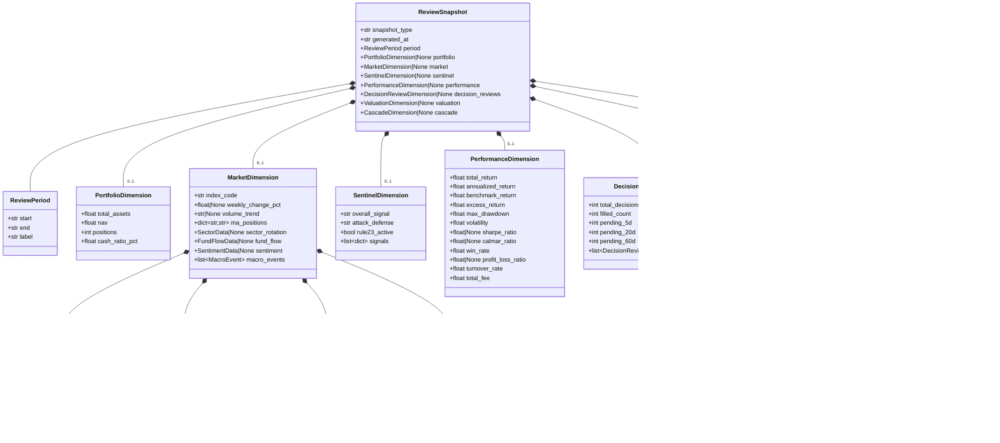
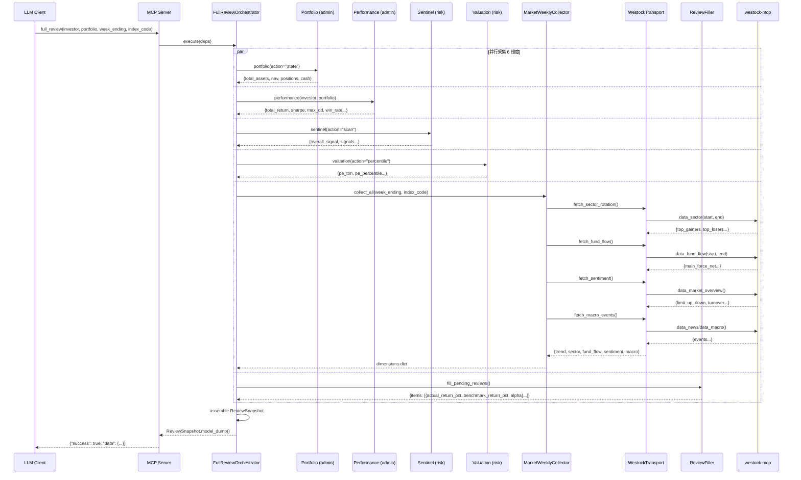
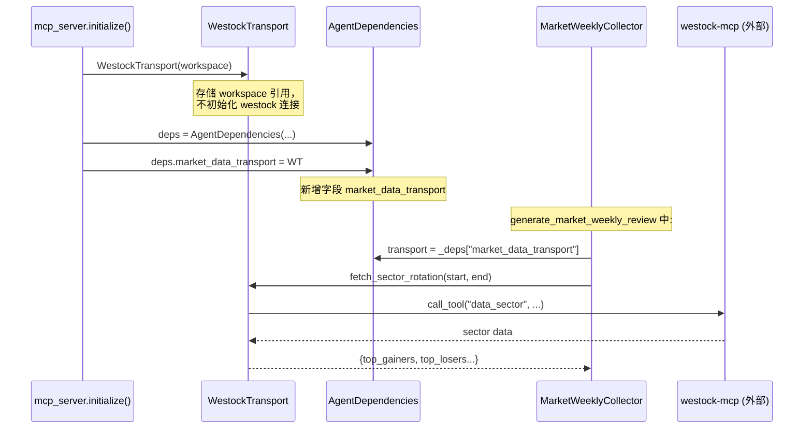
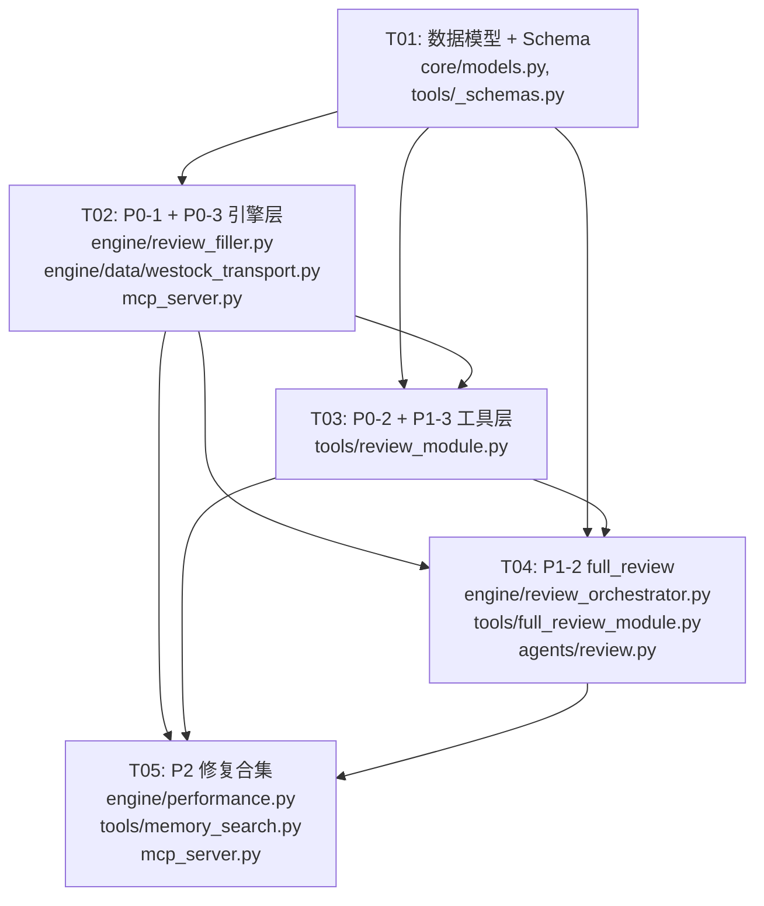

# PRAXIS Agent 复盘工具格式统一重构 — 架构设计方案

> **设计者**: Bob (Architect)
> **版本**: v1.0
> **日期**: 2025-07-12
> **基准**: PRD v3.6 → v4.0 复盘格式统一重构

---

## Part A: System Design

### 1. 实现方案

#### 1.1 核心技术挑战

| 挑战 | 描述 | 策略 |
|------|------|------|
| **westock-mcp 数据源接入** | 4 个维度（sector/fund_flow/sentiment/macro）需从 MCP 工具获取，但当前 transport 协议调用路径未实现 | 新建 `WestockTransport` 类实现 `MarketDataTransport` Protocol，通过依赖注入传入 `MarketWeeklyCollector` |
| **6 维度并行编排** | full_review 需并行调用 portfolio/performance/sentinel/valuation/market/review 6 个独立子系统 | 使用 `asyncio.gather` + 独立容错，借鉴 `MarketWeeklyCollector` 的 `_safe_fetch` 模式 |
| **复盘数据深埋** | P0-1 的 actual_return/benchmark_return/alpha 已在 `_calculate_review` 中计算但被丢弃 | 在 `fill_pending_reviews` 循环中收集 `review_snapshots` 列表并返回 |
| **字段语义重复** | cascade_review 中 `discipline_report` = discipline + risk_quality，同时又返回 `risk_quality_section` | 将 `discipline_report` 重命名为 `report`（完整报告），`risk_quality_section` 保持为独立结构化数据 |

#### 1.2 框架与库选型

| 组件 | 选型 | 理由 |
|------|------|------|
| 数据模型 | Pydantic v2 (`BaseModel`) | 现有代码统一使用，MCP schema 自动生成 |
| 异步编排 | `asyncio.gather` + 独立 try/except | 现有 `MarketWeeklyCollector` 已验证此模式 |
| 数据序列化 | JSON (标准库 `json`) | 保持与现有 JSONL 存储一致 |
| 协议注入 | 现有 `MarketDataTransport` Protocol | 无需新增抽象层，直接在 `mcp_server.py` 注入 |
| westock-mcp 调用 | MCP SDK 的 `call_tool` | 由外部注入 transport，PRAXIS 内部不直接依赖 westock |

#### 1.3 架构模式

```
┌──────────────────────────────────────────────────────────────┐
│                      MCP Server Layer                        │
│  mcp_server.py → initialize() → DI Container                │
│    ├─ WestockTransport (NEW)                                │
│    ├─ ReviewFiller (MODIFIED: P0-1)                         │
│    ├─ FullReviewOrchestrator (NEW: P1-2)                    │
│    └─ MarketWeeklyCollector (MODIFIED: P0-3 via transport)  │
├──────────────────────────────────────────────────────────────┤
│                      Engine Layer                            │
│  engine/data/westock_transport.py   (NEW)                   │
│  engine/review_orchestrator.py      (NEW)                   │
│  engine/review_filler.py            (MODIFIED)              │
│  engine/performance.py              (MODIFIED: P2 win_rate) │
│  engine/data/market_weekly.py       (UNCHANGED)             │
├──────────────────────────────────────────────────────────────┤
│                      Core Layer                              │
│  core/models.py      (MODIFIED: +ReviewSnapshot +subs)      │
│  core/interfaces.py  (UNCHANGED)                            │
├──────────────────────────────────────────────────────────────┤
│                      Tools Layer                             │
│  tools/review_module.py       (MODIFIED: P0-2, P1-3)       │
│  tools/full_review_module.py  (NEW: P1-2)                   │
│  tools/_schemas.py            (MODIFIED: +input schemas)    │
│  tools/memory_search.py       (MODIFIED: P2 seeds)          │
├──────────────────────────────────────────────────────────────┤
│                      Agent Layer                             │
│  agents/review.py  (MODIFIED: +full_review tool)            │
│  agents/admin.py   (UNCHANGED)                              │
└──────────────────────────────────────────────────────────────┘
```

---

### 2. 文件列表

#### 新建文件（3 个）

| # | 相对路径 | 说明 |
|---|----------|------|
| 1 | `engine/data/westock_transport.py` | 实现 `MarketDataTransport` Protocol，调用 westock-mcp 获取 sector/fund_flow/sentiment/macro |
| 2 | `engine/review_orchestrator.py` | `FullReviewOrchestrator`：并行编排 6 维度聚合，输出 `ReviewSnapshot` |
| 3 | `tools/full_review_module.py` | `full_review` 工具 handler + 注册函数 |

#### 修改文件（8 个）

| # | 相对路径 | 变更摘要 |
|---|----------|----------|
| 4 | `core/models.py` | + `ReviewSnapshot` + 8 个子模型（~180 行） |
| 5 | `tools/_schemas.py` | + `FullReviewInput`, 更新 `ReviewInput` |
| 6 | `engine/review_filler.py` | P0-1: `fill_pending_reviews` 返回 per-decision detail；P1-3: `get_summary` 返回详细统计 |
| 7 | `tools/review_module.py` | P0-2: 消除 `discipline_report`/`risk_quality_section` 重复；P1-3: summary 增强；cascade 结构化输出 |
| 8 | `engine/performance.py` | P2: `win_rate` 修正为基于 review_result 的 actual_return_pct |
| 9 | `agents/review.py` | 注册 `full_review` 工具 |
| 10 | `mcp_server.py` | 注入 `WestockTransport` 到 DI 容器；注入 `FullReviewOrchestrator` |
| 11 | `tools/memory_search.py` | P2: 添加种子数据填充逻辑 |

> 路径基准: `praxis-mcp/src/praxis/`

---

### 3. 数据结构与接口



---

### 4. 程序调用流程

#### 4.1 full_review 全量复盘编排（P1-2 核心流程）



#### 4.2 WestockTransport 注入时序



#### 4.3 P0-1: review_tool(fill) 返回详情

```mermaid
sequenceDiagram
    participant LLM as LLM Client
    participant MCP as MCP Server
    participant RF as ReviewFiller
    participant DR as DecisionRecorder
    participant DP as DataProvider
    participant BP as BenchmarkProvider

    LLM->>MCP: review(action="fill")
    MCP->>RF: fill_pending_reviews()

    loop 每个 EXECUTED 决策
        RF->>DR: get_executed()
        RF->>DP: get_history_kline(ticker, days=90)
        DP-->>RF: kline data
        RF->>BP: get_daily_kline(benchmark_index, start, end)
        BP-->>RF: benchmark kline data
        RF->>RF: _calculate_review → actual_return_pct, benchmark_return_pct, alpha
        RF->>DR: update_review(decision_id, review_type, review_data)
        Note over RF: 收集 review_snapshots.append({...})
    end

    RF-->>MCP: {
        success: true,
        data: {
            filled_5d: 3, filled_20d: 2, filled_60d: 1,
            skipped: 5, errors: [],
            items: [
                {decision_id, ticker, review_type, actual_return_pct, benchmark_return_pct, alpha, notes},
                ...
            ]
        }
    }
    MCP-->>LLM: 返回含每条决策详情的响应
```

---

### 5. 待明确事项

| # | 事项 | 影响范围 | 建议 |
|---|------|----------|------|
| 1 | **westock-mcp 的 Python 调用方式**：是 MCP stdio 子进程还是 HTTP/SSE？ | `WestockTransport` 的实现策略 | 建议先探明 westock-mcp 在 PRAXIS 运行环境中的暴露方式（环境变量 `WESTOCK_MCP_ENDPOINT` 或 stdio command）。如果是 stdio，需要用 `subprocess` + JSON-RPC；如果是 HTTP，用 `httpx` |
| 2 | **memory_search 种子数据来源**：从哪个目录/文件加载种子记忆？ | `tools/memory_search.py` 种子逻辑 | 建议使用 `outputs/reviews/` 目录下的历史复盘报告作为种子数据源 |
| 3 | **win_rate 修正口径**：P2 要求基于 `review_result.actual_return_pct > 0`，但仅已复盘的决策有此数据，未复盘的如何处理？ | `engine/performance.py` | 建议：仅统计有 review_result 的决策，并在结果中标注 `reviewed_only: true` |
| 4 | **full_review 的 period 推断**：用户只传 `week_ending`，portfolio/performance 的 start_date 如何确定？ | `engine/review_orchestrator.py` | 建议：portfolio 用最新快照；performance 默认近 90 天；sentinel 用最新扫描。各维度独立容错 |
| 5 | **WestockTransport 降级策略**：westock-mcp 不可用时如何处理？ | `WestockTransport`, `MarketWeeklyCollector` | 建议：沿用现有降级模式 — 对应维度返回 `{"error": "westock-mcp 不可用: ..."}`，不阻断其他维度 |

---

## Part B: Task Decomposition

### 6. Required Packages

```
# 无需新增 pip 包。所有依赖已在现有 requirements 中：
- pydantic>=2.0.0: 数据模型（已有）
- mcp>=1.0.0: FastMCP server（已有）
- akshare: 估值数据（已有）

# WestockTransport 的实现取决于 westock-mcp 的调用方式：
# - 如果是 HTTP/SSE: httpx（已有）
# - 如果是 stdio subprocess: 标准库 subprocess + json（无需额外依赖）
```

---

### 7. Task List (ordered by dependency)

#### T01: 数据模型 + Schema 基础设施

- **Task ID**: T01
- **Task Name**: 统一 ReviewSnapshot 数据模型定义
- **Source Files**:
  - `core/models.py` — 新增 `ReviewSnapshot`, `ReviewPeriod`, `PortfolioDimension`, `MarketDimension`, `SentinelDimension`, `PerformanceDimension`, `DecisionReviewItem`, `DecisionReviewDimension`, `ValuationDimension`, `CascadeDimension`, `SectorData`, `FundFlowData`, `SentimentData`, `MacroEvent`（~180 行）
  - `tools/_schemas.py` — 新增 `FullReviewInput`；更新 `ReviewInput` 增加 `investor`/`portfolio` 可选字段
- **Dependencies**: 无
- **Priority**: P0

**具体工作内容**:
1. 在 `core/models.py` 中定义 14 个 Pydantic v2 模型（参考 PRD 统一 Schema 草案）
2. 所有字段使用 `Field(description=...)` 标注
3. `ReviewSnapshot.snapshot_type` 使用 `Literal["full", "market_weekly", "cascade_monthly", "decision_review"]`
4. 在 `tools/_schemas.py` 新增 `FullReviewInput(BaseModel)`：`investor`, `portfolio`, `week_ending`, `index_code`
5. 更新 `ReviewInput` 添加 `investor`/`portfolio` 可选参数

---

#### T02: P0-1 + P0-3 引擎层实现

- **Task ID**: T02
- **Task Name**: 复盘详情回传 + WestockTransport 市场数据接入
- **Source Files**:
  - `engine/review_filler.py` — P0-1: `fill_pending_reviews()` 收集并返回 `items` 列表（每条的 `decision_id`, `ticker`, `review_type`, `actual_return_pct`, `benchmark_return_pct`, `alpha`, `notes`）
  - `engine/data/westock_transport.py` — **新建**：`WestockTransport` 类实现 `MarketDataTransport` Protocol 的 5 个方法（~150 行）
  - `engine/data/market_weekly.py` — 无需改动（通过 transport 注入自动生效）
- **Dependencies**: T01（需要 `ReviewSnapshot` 子模型中的 `DecisionReviewItem`）
- **Priority**: P0

**具体工作内容**:
1. P0-1: 在 `ReviewFiller.fill_pending_reviews()` 的循环中，将每条成功回填的决策信息 append 到 `review_items` 列表；返回 `{"success": True, "data": {"filled_5d": N, ..., "items": review_items}}`
2. P0-3: 创建 `WestockTransport`:
   - `__init__(self, workspace: str)` — 存储 workspace
   - `fetch_index_trend()` — 保持现有 K 线逻辑（不走 westock，走 DataProvider 降级）
   - `fetch_sector_rotation()` → 调用 westock-mcp `data_sector`
   - `fetch_fund_flow()` → 调用 westock-mcp `data_fund_flow`
   - `fetch_sentiment()` → 调用 westock-mcp `data_market_overview`
   - `fetch_macro_events()` → 调用 westock-mcp `data_news`/`data_macro`
   - 每个方法独立 try/except，失败返回 `{"error": str(e)}`
3. 在 `mcp_server.py` 的 `initialize()` 中：
   - 实例化 `WestockTransport(workspace=WORKSPACE)`
   - 注入到 `AgentDependencies`（需在 `AgentDependencies` 中添加 `market_data_transport` 字段，或在 review_module 中通过 `_deps` 传递）

> ⚠️ **关于 westock-mcp 调用方式**：本次实现先创建 stub 版本，使用 `subprocess` + JSON-RPC over stdio。如果实际环境是 HTTP/SSE，后续调整 `WestockTransport` 内部实现，接口不变。

---

#### T03: P0-2 + P1-3 复盘工具层增强

- **Task ID**: T03
- **Task Name**: cascade_review 字段去重 + review summary 详细统计
- **Source Files**:
  - `tools/review_module.py` — P0-2: 消除字段重复；P1-3: `get_summary` 增强；cascade 结构化输出
- **Dependencies**: T01（需要 `CascadeDimension`、`DecisionReviewDimension` 模型）, T02（需要 `fill_pending_reviews` 返回 items）
- **Priority**: P0

**具体工作内容**:
1. P0-2: 修改 `_generate_monthly_report` / `_generate_quarterly_report` / `_generate_annual_report`：
   - `discipline_report` → 仅包含 discipline 部分（不含 risk_quality）
   - 新增 `report` 字段 = discipline_report + risk_quality_section（完整 markdown）
   - `risk_quality_section` 保留独立字段
   - 新增 `structured` 字段 = `CascadeDimension.model_dump()`（P2 前瞻：结构化输出）
2. `_generate_quarterly_report`: 同样处理
3. `_generate_annual_report`: 同样处理
4. P1-3: 修改 `review()` 函数中 `action == "summary"` 分支：
   - 调用 `filler.get_summary()` → 改为 `filler.get_detailed_summary()`
   - 返回 `DecisionReviewDimension` 结构：total_decisions, filled_count, pending_5d/20d/60d, items（最近 20 条）
5. 在 `ReviewFiller` 中新增 `get_detailed_summary()` 方法：读取已复盘决策的 `review_result` JSON，反序列化后收集统计

---

#### T04: P1-2 full_review 编排器

- **Task ID**: T04
- **Task Name**: full_review 全量复盘聚合工具
- **Source Files**:
  - `engine/review_orchestrator.py` — **新建**：`FullReviewOrchestrator` 类（~120 行）
  - `tools/full_review_module.py` — **新建**：`full_review` handler + `register()`（~60 行）
  - `agents/review.py` — 注册 `full_review` tool
- **Dependencies**: T01（需要 `ReviewSnapshot`）, T02（需要 WestockTransport）, T03（需要 review summary）
- **Priority**: P1

**具体工作内容**:
1. `FullReviewOrchestrator.__init__(self, deps: AgentDependencies)` — 接收依赖容器
2. `async execute(self, investor, portfolio, week_ending, index_code) -> ReviewSnapshot`:
   - 并行调用 6 个维度（`asyncio.gather` + 独立 try/except）：
     - `_fetch_portfolio()` → `portfolio(action="state")`
     - `_fetch_performance()` → `performance_calculator.calculate()`
     - `_fetch_sentinel()` → `sentinel_engine.scan()`
     - `_fetch_valuation()` → `valuation.get_valuation_percentile()`
     - `_fetch_market()` → `MarketWeeklyCollector(transport).collect_all()`
     - `_fetch_decision_reviews()` → `review_filler.fill_pending_reviews()`
   - 组装 `ReviewSnapshot` 并返回
3. `tools/full_review_module.py`:
   - `async def full_review(...) -> dict` — 接收参数，调用 orchestrator，返回 `ReviewSnapshot.model_dump()`
   - `def register(registry)` — 注册为 MCP tool
4. `agents/review.py`: 在 `_register_tools()` 中添加 `full_review` Tool

---

#### T05: P2 修复合集 + 集成收尾

- **Task ID**: T05
- **Task Name**: win_rate 修正 + memory_search 种子 + cascade 结构化 + 全链路集成
- **Source Files**:
  - `engine/performance.py` — P2: `win_rate` 修正为基于 `review_result.actual_return_pct > 0`
  - `tools/memory_search.py` — P2: 添加种子数据加载逻辑
  - `tools/review_module.py` — P2: cascade 结构化输出收尾
  - `mcp_server.py` — 注入 `FullReviewOrchestrator`，注入 `WestockTransport`，更新 `AgentDependencies`
- **Dependencies**: T02, T03, T04
- **Priority**: P2

**具体工作内容**:
1. `engine/performance.py`: 修改 `win_rate` 计算逻辑：
   - 从 `FileDecisionRecorder` 读取已复盘决策的 `review_result`
   - `win_count` = `actual_return_pct > 0` 的决策数（仅计算有 review_result 的）
   - 返回中标注 `win_rate_basis: "reviewed_only"` 和 `reviewed_count`
2. `tools/memory_search.py`: 添加 `_seed_from_reviews()` 函数：
   - 在 `memory_search()` 首次调用时（懒加载），扫描 `outputs/reviews/` 目录
   - 将历史复盘 summary 写入 `memory_store` 的 `reviews` 集合
3. `tools/review_module.py`: 确保 cascade 的三个模式（monthly/quarterly/annual）都返回 `structured` 字段
4. `mcp_server.py`:
   - 在 `initialize()` 中注入 `market_data_transport` 到 `_deps` 字典
   - 注入 `full_review_orchestrator` 实例
5. 端到端验证（手动触发一次 full_review 调用，检查返回结构完整性）

---

### 8. Shared Knowledge

跨文件约定，供 Engineer 实现时参考：

```
## 数据格式约定
- 所有日期/时间使用 ISO 8601 格式: "2025-07-12T14:30:00+08:00"
- 百分比数值统一使用浮点小数（如 0.052 表示 5.2%），在 model 中通过 Field description 标注单位
- 所有金额单位为"元"（CNY）

## 错误处理约定
- 每个维度独立容错：单个维度失败不阻断其他维度
- 失败维度在 ReviewSnapshot 对应字段设为 None
- 所有 API 响应遵循 {"success": bool, "data": dict|None, "error": str|None} 格式

## 并行调用约定
- 使用 asyncio.gather(return_exceptions=True) 确保单点失败不传播
- 借鉴 MarketWeeklyCollector._safe_fetch() 模式：每个维度 wrap 在独立 try/except 中

## 依赖注入约定
- 所有新建 engine 类通过 _deps dict 注入到 tool handler
- 不在 tool handler 中直接 new 实例，统一在 mcp_server.initialize() 中创建

## Pydantic 约定
- 所有模型定义在 core/models.py 中（单一真相源）
- 使用 Pydantic v2 语法：model_dump() 而非 dict()
- 可选字段使用 X | None（Python 3.10+ 语法）

## WestockTransport 约定
- 不缓存数据，每次调用实时获取
- 超时设置为 15 秒/维度
- westock-mcp 不可用时返回 {"error": "westock-mcp unavailable: ..."}
```

---

### 9. Task Dependency Graph



---

*文档结束*
