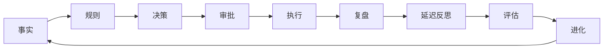

# PRAXIS 投研纪律系统

> **Practice, Reflection, And eXponential Improvement System**
> 可验证、可审计、可复盘、可进化的个人投研纪律系统

---

## 🎯 系统定位

**v4.0.0 定位**：单工具链式 SOP + 级联复盘体系 + 状态卡联动 + PortfolioParser 重构

**核心理念**：**工具负责算，状态卡负责记，AI 负责串。**

**核心价值**：
- 🔗 **单工具链式 SOP** — 9 大场景串行调用链，杜绝并发卡死
- 📊 **级联复盘体系** — monthly/quarterly/annual 三级复盘，READ → TOOL → WRITE 状态卡联动
- 🔌 **工业级数据源** — MX (API+Key) → 腾讯 → 东财 → akshare 四级降级链，单点故障隔离
- 🧠 **增强关键词情感** — 否定翻转 + 强信号保护，93% 命中率，<0.1s 响应
- 📈 **AlphaEar 新闻** — NewsNow API，10+ 信源（财联社/华尔街见闻/雪球等）
- 🔒 **限流保护** — 令牌桶 + 随机抖动，东财 API 间隔 ≥ 1s
- ⚡ **熔断机制** — 连续 3 次失败自动冷却 10 分钟
- 🛡️ **10s 超时斩杀** — akshare 调用超过 10s 自动终止，不阻塞 MCP 管道

---

## 📚 核心文档

### 文档金字塔（优先级向下覆写）

```
🟥 Tier 0: 红线法典     project.md / AGENTS.md / REDLINE_RULES.md / soul.md
🟧 Tier 1: AI 行为宪法  SOP_INDEX.md (附录) / cascade_review / Skills / MEMORY.md
🟨 Tier 2: 架构蓝图     设计文档 / ROADMAP.md
🟩 Tier 3: 参考字典     API.md / README.md / DEVELOPMENT.md
```

**冲突时 Tier 0 永远大于 Tier 3。** 详见 [[docs/SOP_INDEX]]。

### 核心文件
- [[project.md]] — **唯一真相源（SSOT）** — 持仓/网格/止损/观察池/铁律
- [[finance_status_card.md]] — 展示层 — 净值/收益率/资产配比
- [[long-term.md]] — 历史归因 — 铁律规则 + 参数变更记录（执行 5 日滚动归档 (超 5 日的旧记录从头部删除)）
- [[soul.md]] — 投资灵魂 — 底层投资哲学

### 知识图谱（obsidian/ 目录）
- [[01-核心策略铁三角]] — 三张状态卡的关系与校验
- [[02-AI投研团队]] — 三团队配置与编排器
- [[03-自动化闭环]] — 对账 → 校验 → 进化
- [[04-交易账本设计]] — append-only 账本
- [[05-决策记录设计]] — 决策记录与复盘回填
- [[06-绩效指标体系]] — 绩效指标与基准对比
- [[07-进化引擎设计]] — 元进化与灰度验证
- [[08-Prompt安全策略]] — Prompt 四层结构
- [[09-规则分级体系]] — 6 级规则分级
- [[10-写操作安全]] — 幂等/原子/审计
- [[11-MCP工具清单]] — 28 个活跃 MCP 工具
- [[12-CLI命令手册]] — CLI 命令

---

## 🏗️ 系统架构

```
┌─────────────────────────────────────────────────────────────┐
│                    Skill 层 (13 个 Skill)                     │
│  daily-review / trading-session / weekly-review              │
│  monthly-review / quarterly-review / annual-review           │
│  three-team / quick-check / reconcile / stock-query          │
│  ↓ 串行调用 + 状态卡联动 (READ → TOOL → WRITE)               │
├─────────────────────────────────────────────────────────────┤
│                    MCP 层 (28 个活跃工具)                      │
│  行情5 + 组合5 + 交易3 + 团队4 + 新闻2 + 策略9               │
│  cascade_review_tool (monthly/quarterly/annual)              │
├─────────────────────────────────────────────────────────────┤
│                    praxis_sdk (规则引擎)                      │
│  LCD 冲突检测 · 规则审计 · 引力热力图 · 元进化                │
├─────────────────────────────────────────────────────────────┤
│                    数据层 (四级降级 + 单点隔离)                 │
│  MX 妙想 → 腾讯财经 → 东方财富 → akshare (10s超时)            │
│  令牌桶限流 + 熔断器 + TTL 缓存                               │
│  资金流向 + 龙虎榜 + 北向资金 + 研报 + 哨兵雷达               │
├─────────────────────────────────────────────────────────────┤
│                    事实层 (三张状态卡)                         │
│  project.md (SSOT) │ finance_status_card.md │ long-term.md   │
│  transactions.jsonl │ 审计日志 │ evolution_memory             │
└─────────────────────────────────────────────────────────────┘
```

---

## 🔗 9 大实战场景

### 第一梯队：主力作战

| 场景 | 触发时机 | 调用链 | 状态卡 |
|---|---|---|---|
| ①查询个股 | "XX怎么样" | market_data → fund_flow → news → sentiment → check_constraints | READ: 观察池 |
| ②持仓网格 | 盘中盯盘 | portfolio → trading+nav → market_data → check_constraints | READ: 持仓 → WRITE: 条件单 |
| ③选股 | 自上而下 | sentinel → valuation → dragon_tiger → news+sentiment → research | READ: 选股规则 → WRITE: 观察池 |
| ④复盘 | 日终/周末 | reconcile → portfolio+nav → performance+benchmark | READ: 净值 → WRITE: 资产配比 |
| ⑤归因进化 | 策略调整 | review → evolution → 【人工复核】 → strategy | READ: 铁律 → WRITE: 参数记录 |

### 第二梯队：特种后勤

| 场景 | 触发时机 | 调用链 |
|---|---|---|
| ⑥沙盒研发 | 验证新策略 | run_backtest → trading_friction → grayscale |
| ⑦AI查岗 | 问责AI决策 | get_ai_tracking → agent_tracking → team_tool |
| ⑧极端干预 | 数据错乱 | data_quality → 【逐项定位】→ update_portfolio |
| ⑨系统重置 | 初始化 | discover_workspace → investor → orchestrator |

> 详见 [[docs/SOP_INDEX.md (附录)_v3.5]]

---

## 📜 10 条铁律

| 编号 | 名称 | 核心逻辑 |
|:---:|:---|:---|
| Rule 1 | 🚀 价格到位即买 | **[最高优先级]** ETF 网格触发绝对豁免仓位限额 |
| Rule 2 | 情绪起爆器 | ≤2哨兵 + RSI<20 → 放宽仓位 |
| Rule 3 | 阶梯仓位 | 哨兵数 → 20/30/40/60% 四档 |
| Rule 4 | 条件单退场 | 1天暂停，2天取消 |
| Rule 5 | 估值底线 | PE>80%且PB>70% 拦截 |
| Rule 6 | 科技暴露 | ≤ 25% |
| Rule 7 | 周期陷阱 | 煤炭/半导体需景气度验证 |
| Rule 8 | 可控追高 | ≤总资产 × 3% |
| Rule 9 | 底仓锚定 | 单笔基准 10%（≈¥7,000） |
| Rule 10 | 刚性止损 | **全系统 -5% 铁壁** |

> 详见 [[project.md]]

---

## 🔧 v4.0 新增模块

### 1. 单工具链式 SOP
- Bundle 并发架构彻底清除（5 个函数物理删除）
- 9 大场景串行调用链，每个场景有 READ → TOOL → WRITE 联动
- 状态卡写入必须先展示 diff，主理人确认后才落地

### 2. 级联复盘体系
- `cascade_review_tool` — monthly/quarterly/annual 三级复盘
- 月度：纪律代价月报
- 季度：3 个月聚合 + 进化评估
- 年度：12 个月 + 铁律审计

### 3. 数据源单点故障隔离
- 批量查询时，一个标的失败只降级该标的，不拖垮整批
- akshare 10s 超时斩杀（asyncio.wait_for + to_thread）
- remaining 队列：已成功的 ticker 不再送下一个源

### 4. AlphaEar 新闻集成
- NewsNow API，10+ 信源（财联社/华尔街见闻/雪球/同花顺等）
- 10s 超时保护，超时静默抛弃

### 5. 增强关键词情感分析
- 否定翻转 + 强信号保护
- 93% 命中率，<0.1s 响应
- FinBERT 已删除（保护 MCP stdio 管道）

### 6. Skills 全面重写（13 个）
- daily-review / trading-session / weekly-review 全部串行化
- monthly-review / quarterly-review / annual-review 新增
- 所有 Skill 注入状态卡联动矩阵

### 7. SOP Index 文档金字塔
- Tier 0-3 四级优先级
- 冲突时 Tier 0 永远大于 Tier 3
- 引流锚点植入 project.md / AGENTS.md / README.md

### 8. 哨兵矩阵重构（v4.0 新增）
- 剔除 511220 城投债ETF（跷跷板逻辑 Bug），回归纯权益
- 159601 A50 → 159928 消费ETF，515050 通信 → 516970 基建ETF
- 新增 512100 中证1000ETF（中小盘流动性体温计）
- 8 哨兵对应 8 独立维度：大盘|成长|情绪|消费|中小盘|科技|政策|防御

### 9. 投资哲学升级（v4.0 动能觉醒）
- soul.md 信条 1 重写（右侧顺势肯定）+ 新增信条 7（破除恐高与顺势法则）
- 引入 🚀 动能截击附则（手工沙盒阶段）
- cash_floor 动态化：由哨兵快照自动计算，不再依赖静态 YAML
- 000002 示例股份为首个 🚀 动能跟踪 沙盒标的

---

## 🛡️ 安全机制

### Prompt 安全
- [[08-Prompt安全策略]] — 四层结构 + 安全扫描
- base 层不可自动修改

### 规则系统
- [[09-规则分级体系]] — 6 级规则分级
- hard_invariant / hard_block / soft_warning / advisory

### 写操作保护
- [[10-写操作安全]] — 幂等/原子/审计
- 先展示后写入，主理人确认

### MCP 管道保护
- 禁止在 MCP 进程内加载 PyTorch/transformers
- C-level stdout 会污染 JSON-RPC 管道

---

## 📊 投研闭环



---

## 📈 项目状态

| 阶段 | 状态 | 说明 |
|:----:|:----:|------|
| R0-R5 | ✅ | 核心功能完成 |
| v2.0 | ✅ | MCP 工具精简 |
| v2.1 | ✅ | Skill 体系 + 战机座舱渲染 |
| v2.2 | ✅ | 交易时钟 + 数据源硬熔断 |
| v3.0 | ✅ | 工程韧性升级（断点/分级/校验） |
| v3.1 | ✅ | 数据层熔断降级链 + Deep Data 工具 |
| v3.3 | ✅ | 三级降级链 + 限流器 + 熔断器 |
| v4.0 | ✅ | PortfolioParser 重构 + 风控黑名单修复 + BSE 支持 |

---

## 🔗 快速导航

### 按角色
- [[project.md]] — 持仓/网格/止损/观察池（唯一真相源）
- [[02-AI投研团队]] — 三团队配置与编排器
- [[11-MCP工具清单]] — 28 个 MCP 工具

### 按功能
- [[docs/SOP_INDEX.md (附录)_v3.5]] — 9 大场景调用链
- [[docs/SOP_INDEX]] — 文档金字塔
- [[12-CLI命令手册]] — CLI 命令

---

#PRAXIS #投研系统 #MOC #v4.0
