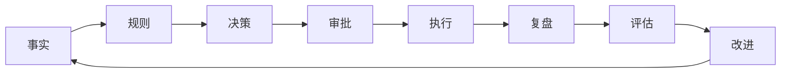

# PRAXIS 投研纪律系统

> **Practice, Reflection, And eXponential Improvement System**
> 可验证、可审计、可复盘、可进化的个人投研纪律系统

---

## 🎯 系统定位

**V1 定位**：个人 A 股 / ETF / 场外基金组合的投研纪律系统

**核心价值**：
- 📊 投研闭环验证（策略是否跑赢基准）
- 🔒 纪律约束执行（风控规则不可绕过）
- 📝 决策全程记录（可复盘、可追溯）
- 🧬 策略持续进化（基于绩效数据，非事后叙事）

---

## 📚 核心文档

### 文档（docs/ 目录）
- [[docs/API]] — API 文档
- [[docs/DEPLOYMENT]] — 部署文档
- [[docs/INTEGRATION_GUIDE]] — 接入指南
- [[docs/REDLINE_RULES]] — 开发红线规则

### 知识图谱（obsidian/ 目录）
- [[01-核心策略铁三角]] — 策略设计
- [[02-AI投研团队]] — AI 团队配置
- [[03-自动化闭环]] — 自动化流程
- [[04-交易账本设计]] — 账本设计
- [[05-决策记录设计]] — 决策记录
- [[06-绩效指标体系]] — 绩效指标
- [[07-进化引擎设计]] — 进化引擎
- [[08-Prompt安全策略]] — Prompt 安全
- [[09-规则分级体系]] — 规则系统
- [[10-写操作安全]] — 写操作保护
- [[11-MCP工具清单]] — MCP 工具
- [[12-CLI命令手册]] — CLI 命令

---

## 🏗️ 系统架构

```
┌─────────────────────────────────────────────────────────┐
│                    接入层 (Access Layer)                   │
│  MCP Server (Claude Desktop) + CLI (开发调试)             │
├─────────────────────────────────────────────────────────┤
│                    决策层 (Decision Layer)                 │
│  Decision Record → 人工审批 → 执行 → 复盘                │
├─────────────────────────────────────────────────────────┤
│                    研究层 (Research Layer)                 │
│  AI 团队（ASRG / 大师圆桌 / 交易团队）                    │
├─────────────────────────────────────────────────────────┤
│                    规则层 (Rule Layer)                     │
│  风控约束 · 交易纪律 · 策略参数                           │
├─────────────────────────────────────────────────────────┤
│                    事实层 (Fact Layer)                     │
│  配置：YAML │ 账本：JSONL │ 状态：缓存 │ 审计：日志       │
└─────────────────────────────────────────────────────────┘
```

---

## 🔧 核心模块

### 交易账本
- [[04-交易账本设计]] — append-only，不可覆盖
- 错误用反向冲销，不用覆盖
- 幂等键防重复写入

### 决策记录
- [[05-决策记录设计]] — 记录每次决策的上下文
- AI 团队信号 + 信心度 + 预期 + 后验结果
- 5d/20d/60d 复盘回填

### 绩效验证
- [[06-绩效指标体系]] — 最大回撤/夏普比率/超额收益
- 基准指数对比（沪深300/中证500）
- AI 建议命中率统计

### 进化引擎
- [[07-进化引擎设计]] — 基于绩效数据，非事后叙事
- 修改前自动备份
- 人工 Diff 终审

---

## 🛡️ 安全机制

### Prompt 安全
- [[08-Prompt安全策略]] — 四层结构 + 安全扫描
- base 层不可自动修改
- 变更需人工审批

### 规则系统
- [[09-规则分级体系]] — 6 级规则分级
- hard_invariant / hard_block / soft_warning / advisory
- 每个规则有测试用例

### 写操作保护
- [[10-写操作安全]] — 幂等/原子/审计
- 幂等键防重复
- 原子写入
- 审计日志

---

## 📊 投研闭环



---

## 🧪 测试覆盖

| 模块 | 测试数 | 状态 |
|------|:------:|:----:|
| Pydantic Schema | 15 | ✅ |
| 交易账本 | 13 | ✅ |
| 约束检查器 | 10 | ✅ |
| 配置加载器 | 14 | ✅ |
| 状态重建器 | 7 | ✅ |
| 绩效计算器 | 5 | ✅ |
| 决策记录器 | 10 | ✅ |
| 进化引擎 | 6 | ✅ |
| CLI 端到端 | 11 | ✅ |
| 错误路径 | 8 | ✅ |
| 规则系统 | 15 | ✅ |
| 交易摩擦 | 9 | ✅ |
| 数据质量 | 6 | ✅ |
| Prompt版本 | 8 | ✅ |
| MCP Server | 10 | ✅ |
| MCP 工具 | 45 | ✅ |
| 集成测试 | 63 | ✅ |
| 性能基准 | 11 | ✅ |
| **总计** | **329** | ✅ |

---

## 🔗 快速导航

### 按角色
- [[teams/investor/example]] — 投资者信息
- [[teams/strategy/grid_value]] — 策略配置
- [[02-AI投研团队]] — AI 团队配置

### 按功能
- [[11-MCP工具清单]] — 53 个 MCP 工具
- [[12-CLI命令手册]] — 17 个命令组
- [[../docs/API]] — API 文档

### 按主题
- [[04-交易账本设计]] — 交易记录
- [[05-决策记录设计]] — 决策上下文
- [[06-绩效指标体系]] — 绩效验证
- [[07-进化引擎设计]] — 策略进化
- [[08-Prompt安全策略]] — Prompt 安全
- [[09-规则分级体系]] — 规则系统
- [[10-写操作安全]] — 写操作保护

---

## 📈 项目状态

| 阶段 | 状态 | 说明 |
|:----:|:----:|------|
| R0-R5 | ✅ | 核心功能完成 |
| Phase 6 | ✅ | 投研闭环验证 |
| V1 改进 | ✅ | 测试覆盖率提升 |
| 测试 | ✅ | 329 个测试通过 |
| 覆盖率 | ✅ | 72% |
| 文档 | ✅ | 设计/实施/安全文档 |

---

#PRAXIS #投研系统 #MOC
